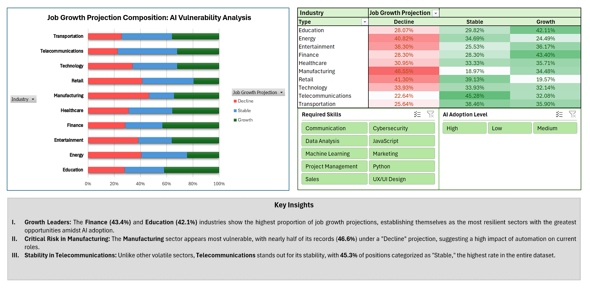

# AI Job Market Insights: Analysis & Projections

This project explores the impact of Artificial Intelligence on the global job market. Using a dataset of 500 records, I analyzed how different industries and skills are positioned against AI automation, identifying sectors of high growth and areas of potential risk.

---

## 📈 Key Insights
Based on the analysis, three main trends were identified:
* **Growth Leaders:** **Finance (43.4%)** and **Education (42.1%)** industries show the highest growth projections.
* **Critical Risk:** The **Manufacturing** sector is the most vulnerable, with **46.6%** of its roles in a "Decline" projection.
* **Stability:** **Telecommunications** stands out as the most stable sector, with **45.3%** of positions categorized as "Stable".

---

## 🖥️ Interactive Dashboard
The project features an Excel-based dashboard with:
* **Heatmap Analysis:** A color-coded contingency table showing the relationship between industry and growth.
* **100% Stacked Bar Chart:** A comparative view of workforce composition.
* **Dynamic Slicers:** Interactive filters for `Required Skills` and `AI Adoption Level`.

> **Note:** Below is a preview of the interactive dashboard included in the Excel file.
> 
> 

---

## 🛠️ Methodology & Tools
* **Excel (Advanced):** Pivot Tables, Power Query, and Conditional Formatting.
* **Data Documentation:** Comprehensive Data Dictionary included for transparency.

---

## 👤 Author
**Javier Sosa**

